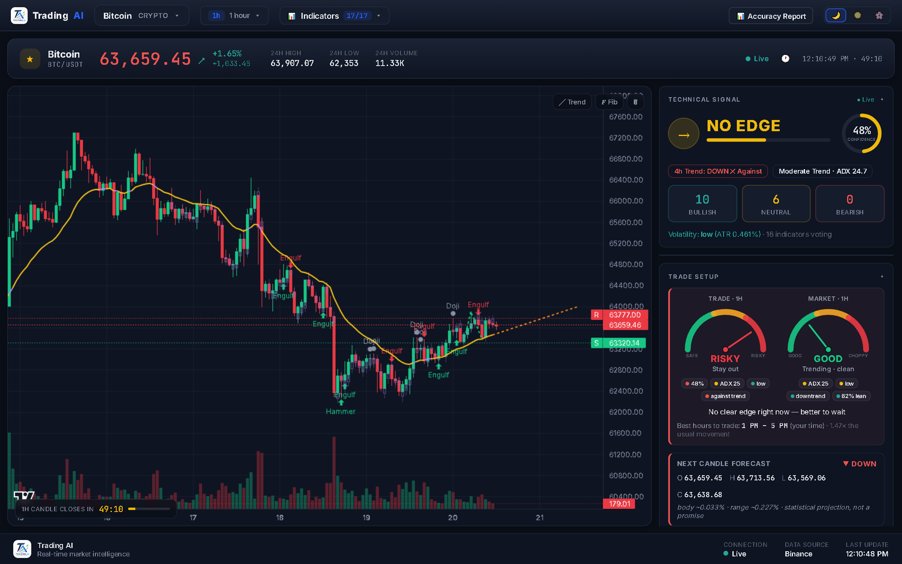
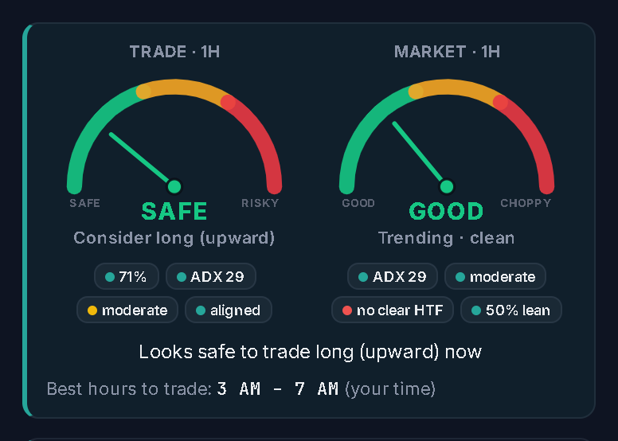
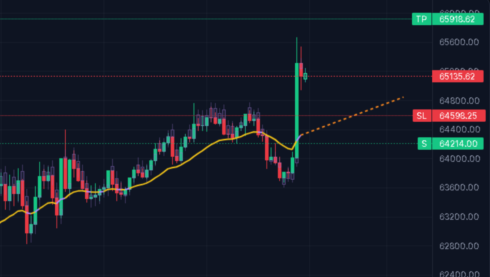

<div align="center">

# AI Trend Predictor

**A real-time, AI-assisted market analysis dashboard for crypto, forex, commodities and indices.**

Live candles, 17 technical indicators, regime-aware signals, AI reasoning, next-candle forecasting and a self-scoring accuracy report — in a clean, broker-style interface.

[](https://ai-trend-predictor-nu.vercel.app)
&nbsp;

&nbsp;

&nbsp;


**[Open the live app →](https://ai-trend-predictor-nu.vercel.app)**



</div>

---

## Overview

AI Trend Predictor turns raw market data into a clear, honest read on direction. It streams live candles, runs a weighted board of 17 technical indicators, layers an AI analyst over the top, and — crucially — **keeps score of its own predictions** so you always know how much to trust it.

Every signal carries a confidence level, and the engine deliberately returns **"no edge"** when the indicators disagree rather than forcing a guess — so you always know how strong the read is.

---

## Demo

<div align="center">


<em>Live candles streaming across timeframes — signal, AI read, risk meters and forecast all updating in real time.</em>

</div>

<table>
<tr>
<td width="42%" valign="top"></td>
<td width="58%" valign="top"></td>
</tr>
<tr>
<td valign="top"><b>Risk meters</b> — two gauges side by side, both tied to the selected timeframe: <b>Trade</b> (is it safe to enter <em>right now</em>?) and <b>Market</b> (is the tape itself clean or choppy?).</td>
<td valign="top"><b>Forecast &amp; average line</b> — the yellow average trend line, purple where it broke against its own prediction, and a dashed orange projection of where it is heading next.</td>
</tr>
</table>

---

## Features

| Area | What it does |
| --- | --- |
| **Live market data** | Tick-by-tick crypto candles (Binance), real-time forex (Finnhub), and stocks / commodities / indices (Yahoo Finance) |
| **17 technical indicators** | RSI, Stochastic, MACD, EMA 9/21 & 50/200, Bollinger, Williams %R, CCI, ROC, Parabolic SAR, SuperTrend, DMI, Ichimoku, Volume, MFI, OBV, VWAP |
| **Regime-aware signal** | Indicators are weighted by market regime (ADX) and confirmed against the higher timeframe, then calibrated to only commit when the board leans decisively |
| **AI analysis** | OpenAI or Claude reads the indicators plus live news headlines and explains the call, with key drivers and a risk note |
| **Next-candle forecast** | Projects the next candle's likely size and placement, drawn as a ghost candle on the chart |
| **Trend prediction** | A multi-horizon read (near / mid / far) of where price is likely to head — direction, projected move, target and confidence for each horizon |
| **Risk meters** | Two speedometer gauges tied to the selected timeframe: *Trade* (safe to enter now?) and *Market* (clean trend vs choppy tape), each with the factors behind the read |
| **Predicted-candle history** | Overlays every past forecast so you can see, at a glance, how often it was right |
| **Trend analysis** | Identifies the current trend, how long it has run, and a survival-based estimate of how much longer it may last |
| **Average trend line** | A coloured moving average — yellow where the trend held, purple where it broke against its prediction, and a dashed orange projection of where it is heading next |
| **Accuracy report** | Forward-tests every prediction and reconstructs historical accuracy: correct / slightly off / completely off, filterable by market and timeframe |
| **Customisable** | Toggle any indicator on/off, send it to the AI, or draw it on the chart — settings persist locally |
| **Responsive** | Works on desktop and mobile, with collapsible panels and a resizable report drawer |

---

## Tech stack

- **Frontend** — React 18, TypeScript, Vite, [Lightweight Charts](https://github.com/tradingview/lightweight-charts)
- **Backend** — FastAPI, pandas, NumPy
- **Data** — Binance (crypto), Finnhub (forex), Yahoo Finance (stocks/commodities/indices), RSS news
- **AI** — OpenAI / Anthropic Claude
- **Hosting** — Vercel (frontend + backend as a single multi-service deployment)

---

## Getting started (local)

### Prerequisites
- [Node.js](https://nodejs.org) 18+
- [Python](https://www.python.org) 3.10+

### 1. Clone
```bash
git clone https://github.com/ralitabi/AI-Trend-Predictor.git
cd AI-Trend-Predictor
```

### 2. Backend
```bash
cd backend
pip install -r requirements.txt
cp .env.example .env          # then add your keys (optional — see below)
uvicorn main:app --port 8742
```

### 3. Frontend (in a second terminal)
```bash
cd frontend
npm install
cp .env.example .env.local    # optional — add a Finnhub key for live forex
npm run dev
```

Open the URL Vite prints (e.g. `http://localhost:5173`).

> **Windows shortcut:** double-click `dev.bat` to launch both servers at once.

### API keys (all optional)

The app runs without any keys — you simply get technical signals only, with delayed forex.

| Key | Where it goes | Enables | Get it |
| --- | --- | --- | --- |
| `OPENAI_API_KEY` | `backend/.env` | AI analysis (GPT) | [platform.openai.com](https://platform.openai.com/api-keys) |
| `ANTHROPIC_API_KEY` | `backend/.env` | AI analysis (Claude) | [console.anthropic.com](https://console.anthropic.com/settings/keys) |
| `VITE_FINNHUB_KEY` | `frontend/.env.local` | Real-time forex streaming | [finnhub.io](https://finnhub.io/register) (free) |

---

## Deployment

The whole app — frontend **and** FastAPI backend — deploys to **Vercel** in one step. See **[DEPLOY.md](DEPLOY.md)** for the full guide; in short:

1. Import the repo at [vercel.com](https://vercel.com). Vercel reads `vercel.json` and builds both services.
2. Add your keys as environment variables (`OPENAI_API_KEY`, `VITE_FINNHUB_KEY`, …).
3. Deploy.

A `render.yaml` is also included if you prefer to host the backend on [Render](https://render.com) instead.

---

## Project structure

```
AI-Trend-Predictor/
├── backend/                 FastAPI app
│   ├── main.py              API routes
│   ├── data/                market data fetchers + cache + SQLite store
│   └── engine/              indicators, signal, forecast, trends, AI, scoring
├── frontend/                React + Vite app
│   └── src/
│       ├── components/      Chart, panels, pickers, report
│       ├── App.tsx          dashboard
│       └── api.ts           backend client
├── vercel.json              multi-service deploy config
├── render.yaml              optional Render backend config
└── DEPLOY.md                deployment guide
```

---

## Contributing

Contributions are welcome — new indicators, data sources, UI improvements, or bug fixes.

1. **Fork** the repository and create a branch: `git checkout -b feature/my-idea`
2. Make your change. Keep the style of the surrounding code (TypeScript on the frontend, typed Python on the backend).
3. Run the checks locally:
   - Frontend: `cd frontend && npm run build` (type-checks and builds)
   - Backend: make sure `uvicorn main:app` starts cleanly
4. **Commit** with a clear message and **open a pull request** describing what you changed and why.

Good first contributions:
- Add a new indicator in `backend/engine/indicators.py` (it slots into the voting board automatically)
- Add a market in `backend/data/assets.py`
- Improve the mobile layout or accessibility

Found a bug or have an idea? [Open an issue](https://github.com/ralitabi/AI-Trend-Predictor/issues).

---

## License

Released under the [MIT License](LICENSE). You are free to use, modify and distribute this project.
